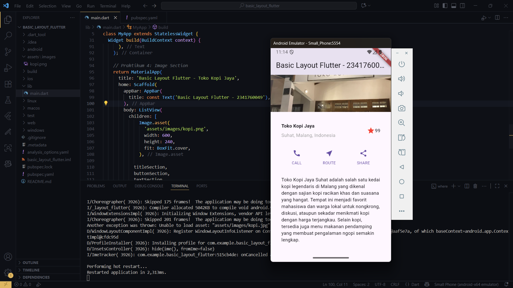

# Basic Layout Flutter - Toko Kopi Jaya Suhat

Project ini merupakan implementasi dari **Flutter Basic Layout Codelab** dengan tema *Toko Kopi Jaya Suhat*. Aplikasi ini menampilkan layout sederhana menggunakan widget dasar Flutter.

---

## Hasil Akhir
Berikut adalah hasil akhir dari implementasi:

---

## Penjelasan
- Project menggunakan widget dasar Flutter (`Row`, `Column`, `Image`, `Text`, `Icon`).
- Tema diganti menjadi **Toko Kopi Jaya Suhat**.
- Gambar yang digunakan: `kopi.png` (disimpan di folder `assets/images`).
- Layout disusun agar menyerupai contoh dari [Flutter layout basics](https://docs.flutter.dev/codelabs/layout-basics), namun dengan konten kustom sesuai tema.

---
